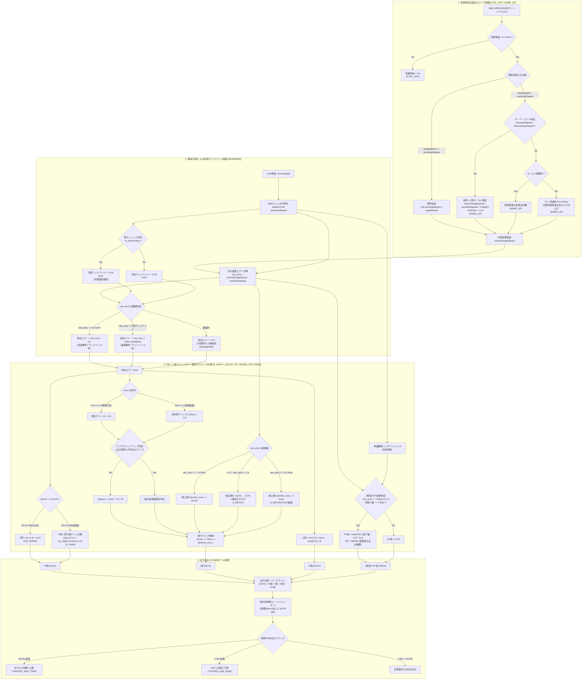

👈 [トップ（README.md）へ戻る](../readme.md)

# クルーズコントロール 制御ロジック フローチャート

```mermaid
flowchart TD
    subgraph S1["1. 目標車速の設定＆ランプ制御 [CTRL_OFF / RAMP_UP]"]
        A["HMI (UP/DOWN/SET) / シリアル入力"] --> B{"目標車速 > 0.1 km/h ?"}
        B -- No --> C["目標車速 = 0.0\n [CTRL_OFF]"]
        B -- Yes --> D{"現在車速との比較"}
        D -- "targetSpeed <= smoothedSpeed" --> E1["即時追従\n internalTargetSpeed = targetSpeed"]
        D -- "targetSpeed > smoothedSpeed" --> E2{"オーバーライド判定\n smoothedSpeed > internalTargetSpeed ?"}
        E2 -- Yes --> E3["追従＋1秒ホールド設定\n internalTargetSpeed = smoothedSpeed + 5.0kph/s\n holdTime = 1.0s\n [RAMP_UP]"]
        E2 -- No --> E4{"ホールド期間中 ?"}
        E4 -- Yes --> E5["目標車速の変更を待機\n [RAMP_UP]"]
        E4 -- No --> E6["ランプ制御 (5.0 km/h/s)\n 内部目標車速を徐々に引き上げ\n [RAMP_UP]"]
        E1 & E3 & E5 & E6 --> F["内部目標車速 internalTargetSpeed"]
    end

    subgraph S2["2. 車速平滑化 ＆ 非対称デッドバンド処理 [DEADBAND]"]
        G["CAN車速 currentSpeed"] --> H["EMAフィルタ平滑化 (alpha=0.05)\n smoothedSpeed"]
        F & H --> I["生の速度エラー計算\n raw_error = internalTargetSpeed - smoothedSpeed"]
        
        H --> J1{"降下トレンド判定\n is_descending ?"}
        J1 -- Yes --> J2["下限デッドバンド = -0.05 km/h\n (早期追従発動)"]
        J1 -- No --> J3["下限デッドバンド = -0.30 km/h"]

        I & J2 & J3 --> J4{"raw_error の範囲判定"}
        J4 -- "raw_error > +0.3 km/h" --> K["有効エラー = raw_error - 0.3\n (加速要求 / デッドバンド外)"]
        J4 -- "raw_error < 下限デッドバンド" --> L["有効エラー = raw_error + lower_deadband\n (減速要求 / デッドバンド外)"]
        J4 -- "範囲内" --> M["有効エラー = 0.0\n (不感帯内 / I項保持)\n [DEADBAND]"]
    end

    subgraph S3["3. PID ＋ 3秒トレンドFF ＋ 動的パラメータ計算 [P_HIGH / I_DECAY / FF_TREND / PID_NORM]"]
        K & L & M --> N["有効エラー error"]

        %% P項
        N --> P1{"|error| > 1.0 km/h ?"}
        P1 -- "No (±1.0kph以内)" --> P2["P項 = Kp (1.5) * error\n [PID_NORM]"]
        P1 -- "Yes (±1.0kph超過)" --> P3["P項 = 折れ線ゲイン計算\n Kp(1.5)*1.0 + Kp_High(3.0)*(error-1.0)\n [P_HIGH]"]

        %% I項
        N --> I1{"error の符号"}
        I1 -- "error >= 0 (車速不足)" --> I2["積分ゲイン Ki = 0.8"]
        I1 -- "error < 0 (車速超過)" --> I3["非対称ゲイン Ki_Decay = 0.8"]

        I2 & I3 --> I4{"アンチワインドアップ判定\n (出力限界 & 同方向エラー?)"}
        I4 -- "Yes" --> I5["I項の新規蓄積を停止"]
        I4 -- "No" --> I6["integral += (error * Ki) * dt"]

        %% 動的I項上限 (アプローチB: Floor=3.0%)
        I --> D1{"raw_error (超過量)"}
        D1 -- "raw_error >= -1.0 km/h" --> D2["I項上限 dynamic_max_i = 15.0%"]
        D1 -- "-4.0 < raw_error < -1.0" --> D3["I項上限を 15.0% → 3.0% へ線形引き下げ\n [I_DECAY]"]
        D1 -- "raw_error <= -4.0 km/h" --> D4["I項上限 dynamic_max_i = 3.0%\n [I_DECAY] (Floor保証)"]

        I6 & I5 & D2 & D3 & D4 --> I7["I項クランプ制限\n -15.0% <= iTerm <= dynamic_max_i"]

        %% D項
        N --> D_CALC["D項 = Kd (0.5) * (error - prevError) / dt"]

        %% 3秒トレンドFF項
        H --> FF1["車速履歴リングバッファ (3秒前参照)"]
        I & FF1 --> FF2{"3秒低下FF発動判定\n raw_error >= 2.0kph かつ 3秒低下量 >= 1.5kph ?"}
        FF2 -- Yes --> FF3["FF項 = min(5.0%, (低下量 - 1.0) * 2.0)\n [FF_TREND] (登坂落ち込み補償)"]
        FF2 -- No --> FF4["FF項 = 0.0%"]
    end

    subgraph S4["4. 出力合成 ＆ PWMガード処理"]
        P2 & P3 --> P_OUT["P項 (pTerm)"]
        I7 --> I_OUT["I項 (iTerm)"]
        D_CALC --> D_OUT["D項 (dTerm)"]
        FF3 & FF4 --> FF_OUT["3秒低下FF項 (ffTerm)"]
        
        P_OUT & I_OUT & D_OUT & FF_OUT --> OUT1["出力合成 = ベースライン (8.0%) + P項 + I項 + D項 + FF項"]
        OUT1 --> OUT2["変化率制限 (レートリミッター)\n 1周期(50ms)あたり ±0.5% 以内"]
        
        OUT2 --> OUT3{"最終PWM出力クランプ"}
        OUT3 -- "40.0% 超過" --> OUT4["40.0% に制限 (上限 CONTROL_MAX_PWM)"]
        OUT3 -- "1.0% 未満" --> OUT5["1.0% に固定 (下限 CONTROL_MIN_PWM)"]
        OUT3 -- "1.0% 〜 40.0%" --> OUT6["計算値をそのまま出力"]
    end
```
