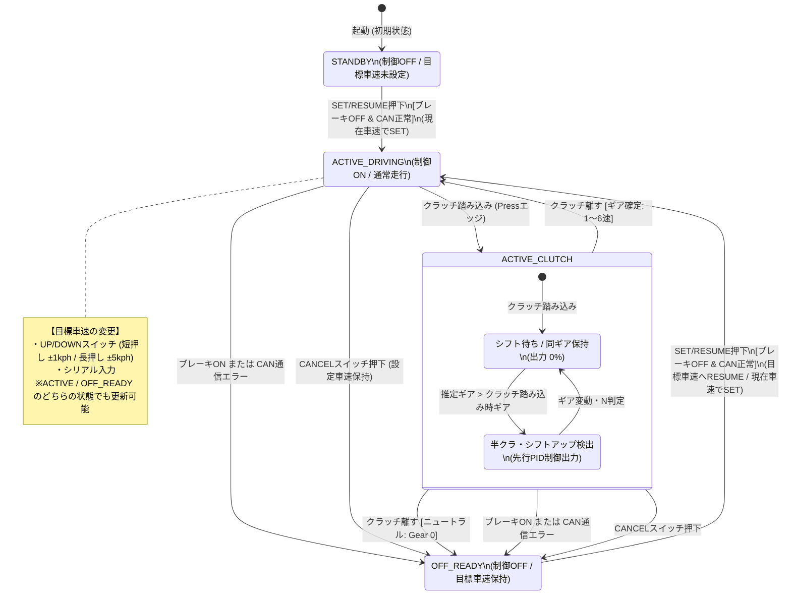

👈 [トップ（README.md）へ戻る](../readme.md)

# クルーズコントロール 制御状態遷移図 (State Diagram)

本ドキュメントでは、クルーズコントロールシステム（ESP32 DIY ASCD）の制御状態の推移および遷移条件を定義します。

---

## 1. 状態遷移図 (Mermaid)

---

## 2. 主要ステートの説明

| ステート名           | 制御状態 (`controlEnabled`) | 内部状況・動作仕様                                                                                                                   |
| :------------------- | :-------------------------: | :----------------------------------------------------------------------------------------------------------------------------------- |
| **`STANDBY`**        |         **`false`**         | 起動直後の初期状態。目標車速 (`targetSpeed`) が未設定 (`0.0 km/h`) の状態です。                                                      |
| **`OFF_READY`**      |         **`false`**         | ブレーキ、CANCELスイッチ、ニュートラル判定等により制御が一時解除された状態。**目標車速は保持**されており、Resume操作で復帰可能です。 |
| **`ACTIVE_DRIVING`** |         **`true`**          | クルーズコントロール作動中。設定された目標車速に対してPID制御＋各種安全フィードフォワードを行いアクセルPWMを出力します。             |
| **`ACTIVE_CLUTCH`**  |     **`true`** (制限付)     | マニュアル車（MT）のシフト操作中。クラッチが踏み込まれている間の一時状態です。                                                       |

### `ACTIVE_CLUTCH` 内部サブステートの詳細

1. **`CLUTCH_WAIT` (シフト待ち / 出力 0%):**
   - クラッチを切った直後の状態。エンジンの吹き上がりを完全に防止するため、アクセル出力は `0%`（スルー）になります。
2. **`CLUTCH_SHIFTING` (半クラ・シフトアップ検出):**
   - シフト操作中にエンジン回転数低下等によって「切断時より上位のギア」が検出された場合、半クラッチで動力が繋がり始めたと判定し、接続ショックを和らげるため制御出力を先行再開します。
3. **クラッチリリース時の自動判定:**
   - クラッチを離した際、ギアが1〜6速に噛み合っていれば **`ACTIVE_DRIVING`** へ自動復帰します。
   - ニュートラル（Gear 0）のままクラッチを離した場合は空吹かし防止のため自動的に **`OFF_READY`**（制御待機）へ遷移します。
