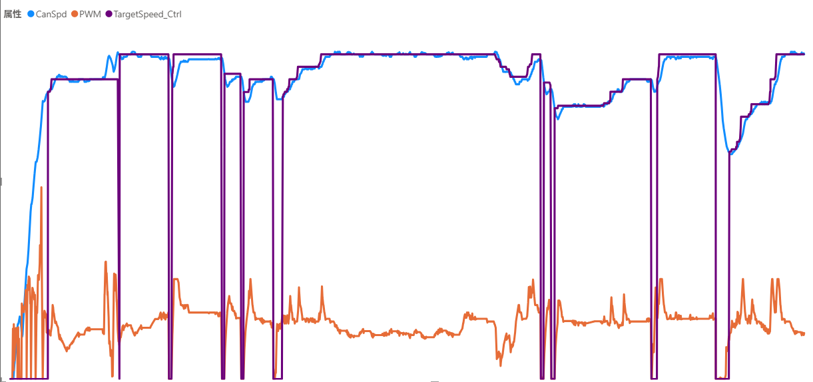

**English** | [ 日本語 ](README.md)

# [SUBARU Impreza STI GRB] ESP32 DIY Cruise Control (ASCD) & Automatic Headlight System

An integrated DIY Cruise Control (ASCD) and Automatic Headlight (AutoLight) control system for real vehicles built with an ESP32 microcontroller.  
It reads vehicle speed (via CAN bus / pulse) and Accelerator Pedal Position Sensor (APPS) signals, maintaining target vehicle speed in real-time through PID calculation.

---
> [!IMPORTANT]
>## ⚠️ Safety Disclaimer

> **WARNING:** Modifying vehicle control systems carries severe risks, including accidents, personal injury, or death. The contents of this repository are provided solely for personal experimentation and technical information sharing, with NO guarantees of functionality or safety. Any implementation or reproduction is strictly at **YOUR OWN RISK**. Avoid testing on public roads and perform experiments only in a safe, controlled environment. The author accepts NO responsibility for any damages, injuries, or accidents incurred.

> **NOTE:** This project was developed based on a SUBARU Impreza WRX STI (GRB model). Applying this system to other vehicle models will require significant modifications to wiring and control parameters.

> **NOTE:** Standard accelerator pedals feature dual redundant output signals, often with an offset voltage between them depending on the vehicle model. If present, this offset must be maintained to prevent triggering a vehicle fail-safe. However, in the GRB Impreza STI, both outputs share the exact same voltage level. For circuit simplification, this project utilizes only the main signal (1-input / 2-output instead of 2-input / 2-output).
---

## 1. System Overview

This system uses a single ESP32 to independently control and monitor the following features:

1. **Auto Speed Control System (ASCD / Cruise Control)**
   - Receives vehicle speed via CAN bus and measures OEM pedal voltage to adjust throttle (APPS) voltage via PID control.
   - User interface integrated via a TOYOTA OEM ASCD control stalk.
   - Immediate fail-safe cutoff triggered by brake pedal interrupt or anomaly detection.
2. **AutoLight Control**
   - Automatically turns headlights ON/OFF by measuring ambient light using a climate control light sensor (detailed explanation omitted).
3. **Status Display**
   - Real-time display of vehicle speed, target speed, and control states on a 0.96-inch OLED screen.

---
## 2. Development Process (Vibe Coding & Real-Vehicle Testing)

This project was developed utilizing **Vibe Coding** techniques with LLM/AI tools:

- **AI (LLM) Utilization:** Control algorithm (PID / State Machine) design, initial sketch codebase generation, and data structure optimization.
- **Human (Developer) Verification & Assurance:**
  - Multimeter measurement and calibration of physical vehicle signal lines (APPS voltage and speed pulses).
  - Design of hardware-first fail-safes using optocouplers and physical brake relays.
  - PID control parameter tuning and safety testing based on real-world driving data.
---

## 2. Directory Structure and Documentation Links

This repository follows the standard Arduino IDE folder structure. Please refer to the documents in the `Docs/` directory for detailed hardware specifications and control logic.

```text
.
├── Cruise_Control_DIY-Public.ino          # Main sketch file (Open this in Arduino IDE)
├── Config.h                     # Pin assignments and parameter threshold configuration
├── PIDController.cpp / .h       # PID calculation, I-term decay, and FF trend logic
├── DataInput.cpp / .h           # CAN bus (OBD-II / Passive monitoring) & sensor input handling
├── PedalIO.cpp / .h             # APPS voltage reading, PWM output, & fail-safe relay control
├── OledDisplay.cpp / .h         # OLED display rendering and display mode switching
├── AutoLight.cpp / .h           # Automatic headlight control logic
├── Control_Method.md            # Control algorithm and PID specification details
├── LogicDiagram.md              # High-level control logic diagram
├── OBD2_Supported_PIDs_v1.md    # Supported OBD-II PID list
├── README.md                    # Main documentation (Japanese)
├── README_en.md                 # Main documentation (English)
└── Docs/
    ├── Accel_Pedal.md           # 📑 [Details] APPS pinout, wiring guide, & signal specs
    ├── CAN.md                   # 📡 [Details] CAN bus specs (OBD-II / Passive monitoring)
    ├── esp32_pinout.md          # 🔌 [Details] ESP32 pinout & hardware specifications
    ├── LogicFlowChart.md        # 🔄 [Details] Control logic flowchart
    ├── LogicParameter.md        # ⚙️ [Details] Parameter reference & tuning guide
    ├── LogicState.md            # 🚦 [Details] State machine diagram & transition logic
    ├── OLED.md                  # 🖥️ [Details] OLED display specifications
    └── Control_Result_Sample.png # 📈 Real-world speed control test graph
```
---

## 3. Key Pin Assignments Overview

### ESP32 GPIO Assignments (Extract)
- **Inputs:** [Pedal Main Signal (GPIO34)](Docs/Accel_Pedal.md), Photoresistor (GPIO36), Cruise Switch (GPIO14), OLED Display Switch (GPIO33)
- **Outputs:** Pedal PWM Main (GPIO26), AutoLight Relay (GPIO15), ESP32 Ready (GPIO12)
- **Communication:** [OLED](Docs/OLED.md) I2C (SCL: GPIO22 / SDA: GPIO21), [CAN](Docs/CAN.md) (TX: GPIO17 / RX: GPIO16)

👉 **Full Pinout & Circuit Diagram:** [esp32_pinout.md](Docs/esp32_pinout.md)

---

## 4. Circuit Design & Safety Safeguards (Fail-Safe)

To handle surge noise and electrical hazards unique to automotive environments, multiple protective layers are implemented:

[Circuit Design ](Docs/circuit_diagram.png)

1. **Hardware-First Cutoff (Most Critical):**
   When the brake pedal is depressed, a physical relay immediately bypasses the ESP32 and restores direct connection between the OEM pedal sensor and the ECU, regardless of the microcontroller's state.
2. **Control Readiness Monitoring:**
   Only after the `loop()` function executes successfully is `KILL_SWITCH_PIN` pulled HIGH to energize the relay, allowing PWM signal output to reach the vehicle.
3. **Voltage Level Shifting & Divider Protection:**
   Resistor dividers are placed to ensure pedal signals (0.6V–3.5V) do not exceed the ESP32 ADC limit (3.3V).

👉 **Pedal Signal Specs & Wiring Setup:** [Docs/Accel_Pedal.md](Docs/Accel_Pedal.md)

---
## 5. Control Logic Overview

In addition to standard PID control, this system incorporates several proprietary control optimizations tailored for manual transmission (MT) vehicles operating without active physical brake control (throttle-only regulation).

### 5.1 Throttle-Only PID Optimizations
Since control relies solely on throttle position (PWM output) without active braking, smooth acceleration/deceleration, overshoot suppression, and slope tracking are critical.

👉 [Control Logic Flowchart](Docs/LogicFlowChart.md)

- **Soft Deadband & Asymmetric Downward Deadband:**
  - Within $\pm 0.3\,\text{km/h}$ of target speed, I-term updating is frozen to prevent actuator hunting.
  - **Asymmetric Downward Deadband:** When vehicle speed drops or descends toward the target, the negative deadband automatically tightens to $-0.05\,\text{km/h}$, ramping up throttle preemptively before undershooting.
- **Dynamic I-Term Clamping (`I_DECAY` with Guaranteed Floor):**
  - When real speed exceeds target speed by $+1.0\,\text{km/h} \sim +4.0\,\text{km/h}$ (e.g., downhill), the I-term ceiling dynamically decays from 15% to eliminate residual throttle.
  - A floor limit (`3.0%`) is guaranteed to prevent post-decay speed drop.
- **3-Second Speed Trend Feed-Forward (`FF_TREND`):**
  - During slope climbs, if speed decreases by $\ge 1.5\,\text{km/h}$ over 3 seconds and is $\ge 2.0\,\text{km/h}$ below target, a predictive feed-forward throttle boost (up to `5.0%`) is added, eliminating derivative noise lag.
- **Target Speed Ramp Control (`RAMP_UP`):**
  - Upon set speed change or resume, the internal target speed ramps up smoothly at a rate limit of `5.0 km/h/s`.
  - Driver throttle override temporarily syncs internal target speed to current speed, seamlessly resuming cruise control after a 1-second hold upon release.
- **Piecewise P-Gain (`P_HIGH`):**
  - Uses normal P-gain (`1.5`) within $\pm 1.0\,\text{km/h}$ and switches to high P-gain (`3.0`) beyond that for quick recovery.

### 5.2 Manual Transmission (MT) Gear Shift Handling
- **Shift Suppression & Higher Gear Auto-Resume:**
  - Disengaging the clutch (`clutchReleased == false`) stores the active gear.
  - During shifting, PID control auto-resumes only when a higher gear is detected (indicating clutch engagement into a higher gear).
  - If the vehicle remains in the same gear or shifts to neutral, output is locked to `0%` to prevent engine over-revving.

### 5.3 MT Neutral Detection
- **Auto-Cancel on Neutral (Gear: 0):**
  - Releasing the clutch in neutral automatically cancels cruise control (similar to tapping the brake), maintaining the target speed in memory for later Resume.

### 5.4 MT Engine Braking Shock Mitigation
- **I-Term Back-Calculation on Override (`syncIntegral`):**
  - When the driver accelerates past the cruise set speed (override) and actual pedal position (`realPedalADC`) exceeds PID output, the I-term is back-calculated to match actual pedal position.
  - This ensures a seamless transition without sudden engine braking shock when releasing the accelerator.
- **Select-High Output Control:**
  - The final PWM output always selects the maximum value between the PID calculation and actual pedal position.

---

## 6. State Machine Architecture

The system operates across four primary states to balance driving safety and MT shift behavior:

- **`STANDBY` (Initial State):** System ready, target speed unset.
- **`OFF_READY` (Control Standby):** Control paused due to brake input, CANCEL switch, or neutral detection. Set speed retained.
- **`ACTIVE_DRIVING` (Engaged):** Active PID control regulating pedal PWM output toward target speed.
- **`ACTIVE_CLUTCH` (Shifting):** Temporary clutch-disengaged state with 0% output safety lock (except predictive output upon shift-up detection).

👉 **Detailed State Machine & Transition Flowchart:** [Docs/LogicState.md](Docs/LogicState.md)

---

## 7. Real-World Road Test Results

Test data showing target speed tracking across flat roads and gradients:



### Graph Legend
- **Purple Line:** Target Speed [km/h]
- **Blue Line:** Actual Vehicle Speed [km/h]
- **Orange Line:** Control Output (Throttle Position Command) [%]

---

## 8. Development Environment & Setup

1. **IDE:** Arduino IDE
2. **Libraries:** `U8g2` (or `Adafruit_SSD1306`), `ESP32PulseCounter`, etc.
3. **Calibration:**
   1. Adjust APPS upper/lower voltage limits in `Config.h` to match your vehicle's pedal signals.

---

## 9. Cautions During Development

### 9.1 IGN ON Without Pedal Connection
The vehicle ECU continuously monitors APPS voltages. Turning the ignition ON without connecting pedal signals or providing invalid outputs will trigger an ECU DTC fail-safe. Keep an ELM327 OBD-II reader handy to clear diagnostic trouble codes if necessary.
